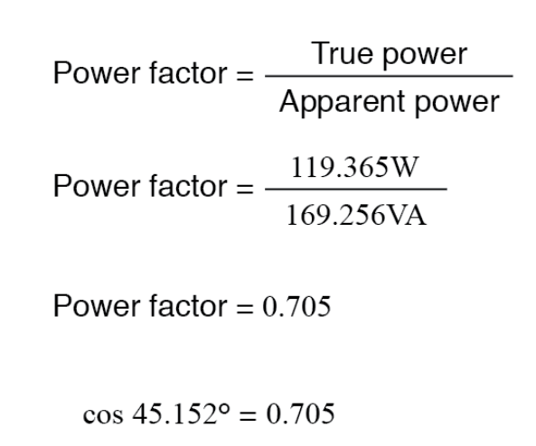

# Energy Meter System (ENMS)

The Energy Meter System (ENMS) is a comprehensive solution for monitoring and managing energy consumption in various applications. This README provides an overview of the key functionalities and features of the ENMS project.

## PARAMETERS

### Current (I)

- **Definition**: The flow of electric charge in a conductor
- **Unit**: Ampere (A)
- **Equation**: I = Voltage / Resistance

### Voltage (V)

- **Definition**: The electric potential difference between two points in a circuit
- **Unit**: Volt (V)
- **Equation**: V = I (current) * R (resistance)

### Resistance (R)

- **Definition**: Opposition to the flow of electric current
- **Unit**: Ohm
- **Equation**: R = Voltage / I (current)

### Frequency (f)

- **Definition**: The number of cycles per second of an alternative current
- **Unit**: Hertz (Hz)
- **Relation with Period**: f = 1 / T

---

## Power (w)

- **Equation**: p = VI (Product of voltage and current)
- **Unit**: Watts 
---

### Apparent Power (S)

- **Definition**: The total power flowing
- **Equation**: AP = Voltage * Current
- **Unit**: Volt-Amps (VA)

---

### Reactive Power (Q)

- **Equation 1**: Q = VI * sin(θ)
- **Equation 2**: Q = S * sin(θ)
- **Definition**: Non-working power in an AC circuit responsible for creating the magnetic field

### Impedance (Z)

- **Equation**: Z = Voltage / I
- **Definition**: Overall opposition that a circuit presents to the flow of alternating current

### R Phase

- Represented as red color
- Carries AC current
- Measured in watts (W)

---

### Y Phase

- Represented as yellow color
- Carries AC current
- Measured in watts (W)
- Electrically displaced by 120 deg from the other phases
- Creates a balancing system that provides a more constant and efficient power supply

---

### B Phase

- Represented as blue color
- Carries AC current
- Measured in watts (W)

---

## Watts

- **Definition**: Measurement of the rate of energy transfer over a unit of time
- **Unit**: Watts (W)
- **Equation**: Watts = Amps x Volts
- **Relation with Power and Energy**: Power is the rate at which energy is used or produced

---

### Power and Energy Relationship

Equation: E = P × t (where E is energy in joules, P is power in watts, and t is time in seconds)

---

### Voltage, Current, and Resistance Relationship (in electrical context)

Equation: P = I × V (where I is the current in amperes and V is the voltage in volts, according to Ohm's Law: V = I × R)

---

## Power Factor (PF ave. - Instantaneous)

- **Definition**: Expression of energy efficiency
- **Unit**: Measured in kilowatts (KW) for instantaneous power
- **Equation**: PF = KW / KVA (Instantaneous Power Factor: cos(θ))

### Active Power

- Also known as real power
- Equation: p = VI * cos(θ)

### Reactive Power

- Arises due to phase difference between voltage and current in an AC circuit
- Equation: Q = VI * sin(θ)

- lagging and leading power factor illustrated in the below image

## Power Factor for R, Y, and B Phase

1) PF for R Phase: PFr = cos(θr)
2) PF for Y Phase: PFy = cos(θy)
3) PF for B Phase: PFb = cos(θb)

Where:

- R, PF Y, and PF B are the power factors for the R, Y, and B phases, respectively.
- θ R, θ Y, and θ B are the phase angles between voltage and current waveforms for the R, Y, and B phases, respectively.

---

## VA Total

- **Definition**: Vector sum of real power (measured in watts)
- **Unit**: Volt-Ampere (VA)
- **Symbol**: VA
- **Equation**: S (Apparent power) = V (Voltage) * I (Current)

**Note** - without power factor

S = V *I* COS(θ)

**Note** - with power factor

## relation with other terms -

**Real power (P)** -

- equation -

p = |S| (magnitude od apparent power) *cos(θ) (phase angle between voltage and current)

**Reactive power (Q)** -

- equation -
Q = |S|  (magnitude of apparent power) * sin(θ)  (θ is the phase angle between voltage and current.)

## Watt-hour (Wh)

- represents the amount of energy consumed or produced by a device with a power rating of one watt over a period of one hour.

**Equation**-

Energy (Wh) = Power (W) * Time (h)

**Defination** -

- a measure of electrical energy equivalent to a power consumption of one Watt for one hour.

**SI unit** -

3600 joules

**Relation** -

**Watt** - is a unit of power.

- one watt is equals to one joule per second.

- P (power) = I (current) * V (voltage)

**Joule** -

- unit of energy.
- one watt-hour is equal to 3600 joules.

equation,

Energy (in watt-hours) = power (in watts) * Time (in hours)

**Volt (V)** -

is the electric potential difference between two poins in an electrical circuit.

- the relationship between energy, power and voltage
 equation,

        Energy (in watt-hours) = Power (in Watts) * Time (in hours) = voltage (in volts) * Current (in amp) * Time (in hours).

**Ampere(A)** -

- unit of electric current.
- reprents the flow of electric charge in a cuircuit.

relation between energy, power and current and time.

Energy (in watt-hours) = power(in watts) *Time(in hours) = Voltage (in volts)* Current (in amperes) * Time (in hours).

---

## VAh (Volt-Ampere-Hour)

- **Equation**: VA = Volts * Amperes

### Ampere-Hour (Ah)

- **Equation**: Ah = Watt-hours / Voltage

---

# Load Hours -

- To derive load hours, information about the power consumed by the load over a certain period is needed.
- Load hours are often expressed in kilowatt-hours (KWh) or megawatt-hours (MWh)

---

# CO2

- **Carbon Intensity Factor**: CO2 emission
- **Equation**: CO2 Emission = Energy Consumption (KWh) * Carbon Intensity Factor (gCO2 / KWh)
- Carbon Intensity Factor calculation

---

## Var (Volt-Ampere Reactive)

Var is a unit of measurment of reactive power.

- mathematical relation 

- Derive

- to find a single phase of VA.

---

---

## Var Total

- Sum of the reactive powers of individual phases (var R, var Y, var B)
- Reactive power is a vector quantity and is determined by the phasor sum of the reactive powers of the individual phases in a three-phase system

---

## KVARh (Kilovolt-Ampere Reactive-Hour)

- Unit of measurement for reactive power consumption or production in an electrical system

- reactive power is required to establish and maintain the magnetic fields in inductive devices such as motors and transformers

## Relations

1) Reactive power

sin(θ) - [the sine of the power factor angle.]

2) Apparent power

3) power factor

4) Real power

---

## KVARH Inductive

- **Definition**: Measures the cumulative reactive power in an electrical system due to inductive loads like motors and transformers
- Causes a lagging power factor, where the current lags behind the voltage

---

## KVARH Capacitive

- **Definition**: Measures the cumulative reactive power in an electrical system due to capacitive loads
- Capacitive loads cause a leading power factor, where the current leads the voltage

---

## V_LL and V_LN(PH) - Average

### V_PH

- VLL represents the voltage between any two line conductors in a three-phase system. It's the effective or RMS value of the voltage waveform.
- Root of 3 helps convert the line-to-line voltage in a balanced system.
- Vln - Line to neutral voltage
- Geometry of a balanced three-phase system
- Phases in such a system are 120 degrees apart from each other

## V RY - YB - BR phases

it is relation with V_LL AND V_PH.

for references

---

## Frequency

- **Definition**: The number of cycles of a periodic waveform that occur in one second
- **Unit**: Hertz (Hz) - 1 Hz is equivalent to one cycle per second
- **Equation**: f = 1 / T, where T is the period of the waveform

where
T is the period of the waveform

## Period (T)

## defination 

- The time taken to complete one cycle of a periodic waveform.

## Equation 

---

## VARH Inductive and Capacitive Loads

- **Definition**: Reactive energy is the integral of reactive power with respect to time, representing the total reactive power supplied or absorbed by a system over a specific period

- equation

### Inductive Reactive Power (Ql)

- QL = V * I * SIN(θ)
- In inductive components (like a motor or transformer), the current lags behind the voltage, resulting in a positive phase angle (θ > 0).

### Capacitive Reactive Power (Qc)

- Qc = V * I * SIN(θ)
- In capacitive components (like a capacitor), the current leads the voltage, resulting in a negative phase angle (θ < 0).

---

## KW Demand

- **Definition**: Kilowatt demand refers to the rate at which electrical power is drawn from the grid or supplied to a system at any given moment, typically measured in kilowatts (kW)
- **Equation**: KW = Pmax / Power Factor

---

### Description of Demand

---

## KVA Demand

- **Definition**: KVA demand refers to the rate at which apparent power is drawn from the electrical system over a specific period, representing the maximum instantaneous value of apparent power during that period
- **Equation**: KVA = Smax

---

### Significance

- KVA demand is crucial for sizing electrical equipment, such as transformers and generators, as it helps determine the capacity required to meet the peak power demand.
